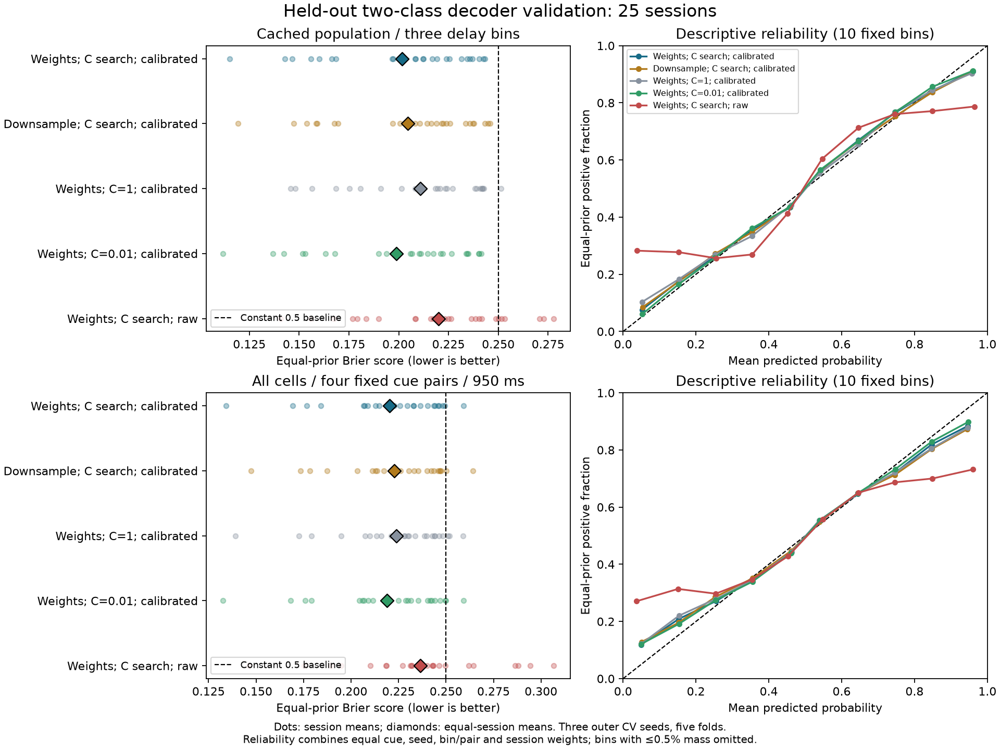

# Decoder quality, state robustness, and cell-count prediction

This **2026-09-30** follow-up to [Statistical choices](statistical-choices.md)
separates three questions: whether a procedure predicts cue probabilities well,
whether its estimated OFF durations are stable, and whether selective-cell
counts predict those durations in held-out sessions. A better M1 score is not
a criterion for selecting the decoder or the state rule.

The new evidence supports **balanced class weights and sigmoid calibration for
probability estimation**, and **joint cell-count prediction of session-mean OFF
durations**. It does not establish a reliable preferred-cell-specific effect
on maximum OFF duration or causal shortening of biological OFF states. It also
finds substantial overlap between cell-count prediction and measured decoder
quality: adding counts to Brier score does not improve total-OFF prediction.
This is a conditional predictive comparison, not a causal adjustment. It
narrows the earlier C-search conclusion: the historical accuracy-based search beats
fixed C=1, but a prespecified fixed **C=0.01** gives better probability scores in
the new weighted validation.

The analyses left production caches unchanged and are exploratory checks on
an existing cohort, not an independent replication. **Subsequent template
decision, 2026-09-30:** the default adopted fixed C=0.01 with C search disabled,
retaining balanced weights and sigmoid calibration. Historical run `005` and
its state/M1 results below still use C search; they are not fixed-C production
results. The [completed `006`/`005` comparison](statistical-choices.md#weighted-fixed-c001-next_run_005-versus-next_run_006)
now supplies full production fixed-C evidence and a separate downstream M1
audit. The original experiments and numerical results on this page remain
unchanged. See the [consolidated recommendation](statistical-choices.md#consolidated-recommendation).

## 1. Test probability quality on both cue classes

The original five-run comparison caches test predictions for the preferred cue only.
Their paired score differences are useful, but cannot establish two-class
decoder performance. The new experiment fits both cue classes with common
five-fold **outer trial holdouts**, using three predefined split/fitting seeds
and 50 ms windows starting at **500, 950, and 1350 ms**. Every window lies within
the delay interval. It covers all 25 sessions; no pair or session is excluded.

Each outer test trial is excluded from training-trial balancing, scaling, C
selection, and calibration. Balanced weights are recomputed within each fitting
fold; calibration uses equal total cue weight. Scores give each cue equal
weight, then average seeds and bins within sessions and weight sessions equally.
The primary comparison uses the same cached stationary cells and selected cue
as production. Full-session screening therefore remains outside its outer CV.

A separate sensitivity removes that activity-derived feature/cue selection:
use **all exported cells** and all four fixed opposite-cue pairs, (1,5), (2,6),
(3,7), and (4,8), at 950 ms in every session. This still conditions on the
previously selected recording cohort. It is not nested replication of the
production screening procedure or an evaluation on new animals.

### Two-class results

Every row except the constant baseline uses balanced class weights unless
marked downsampled. Lower Brier/log loss is better; balanced accuracy and AUC
measure different aspects of performance.

| Procedure | Primary Brier | Primary log loss | Primary balanced accuracy | Fixed-cue/all-cell Brier |
| --- | ---: | ---: | ---: | ---: |
| Downsampled, C search, sigmoid | 0.20450 | 0.59676 | 67.48% | 0.22266 |
| Weighted, C search, sigmoid (historical reference) | 0.20175 | 0.58996 | 68.00% | 0.22041 |
| Weighted, C=1, sigmoid | 0.21074 | 0.61019 | 65.69% | 0.22374 |
| Weighted, C=0.01, sigmoid (current template choice) | **0.19880** | **0.58306** | **68.50%** | **0.21897** |
| Weighted, C search, no calibration | 0.22002 | 0.68113 | 68.29% | 0.23657 |
| Constant probability 0.5 | 0.25000 | 0.69315 | 50.00% | 0.25000 |

For weights versus downsampling, the session-mean Brier difference is
**−0.00275**, with a paired session-bootstrap percentile interval
**[−0.00375, −0.00176]**; 22/25 sessions favor weights. The fixed-cue/all-cell
comparison agrees: **−0.00225 [−0.00356, −0.00104]**, with 20/25 favoring weights.
Mean prediction SD across the three outer-split/fitting seeds falls from
0.05718 to 0.05079 in the primary panel. This combines split, fitting, and
downsampling variation; it is not an isolated estimate of balancing-seed noise.
Weighting also retains more training observations and changes the weighted loss
and its balance with regularization; the comparison tests the complete fitting
procedures, not removal of random downsampling in isolation.

Using the user-confirmed animal mapping, the mean Brier difference for weights
versus downsampling is −0.00265, −0.00375, and −0.00175 in monkeys A, H, and J,
respectively. All three monkeys also favor weighting in the fixed-cue/all-cell
panel. Calibration improves mean Brier/log loss in each monkey in both panels,
as does fixed C=0.01 versus the historical search. This is descriptive consistency
across three animals, not a population-level test with 25 independent animals.

Calibration improves Brier and log loss in both panels. It does **not** improve
every classification metric. In the fixed-cue/all-cell panel, raw probabilities
have balanced accuracy 64.71% and AUC 0.6832, versus 63.79% and 0.6718 after
calibration. The reason to retain calibration here is better probability
estimation, not uniformly better discrimination. Reliability-bin summaries are
included in the evidence, but are noisy and bin-dependent. A constant 0.5
predictor is calibrated to the balanced prior while providing no discrimination;
low calibration error alone is insufficient. See the
[calibration guide](https://scikit-learn.org/1.8/modules/calibration.html) for
the distinction between reliability and proper probability scores.

### C search and averaging need a more precise conclusion

The subsequent [regularization-path study](regularization-confidence.md) tests
C=0.001 through 10⁻¹⁰ and direct probability shrinkage. C=0.01's advantage is
not reproduced by one common shrink factor. C=0.001 is nearly tied in this
primary panel but worse in the all-cell/fixed-cue panel; extremely small C also
exposes numerical calibration problems. The tables below retain the original
five-procedure comparison.

The optional C search used by the historical production reference optimizes **balanced accuracy**, not probability loss.
Weighted fixed C=0.01 improves Brier over that searched-C reference by **0.00295**, with a
paired session-bootstrap interval **[0.00219, 0.00380]** for search minus fixed
C; 24/25 primary sessions favor fixed C. The corresponding sensitivity gain is
**0.00144 [0.00073, 0.00215]**, with 20/25 sessions favoring it. Log loss and
balanced accuracy also improve. Fixed C=0.01 was specified before the full
validation fits; it was motivated by frequent selection of that grid boundary
in existing runs. This is evidence for a promising cheaper candidate, not proof
that it is globally optimal.

Averaging each trial's three held-out searched-C predictions reduces Brier from
**0.20175 to 0.19764**, and from **0.22041 to 0.21590** in the sensitivity.
Every component excludes the scored trial. Improvement relative to the mean
component Brier/log loss follows convexity, so the useful result is the size
of the gain, not a claim of an independent discovery. These are ensembles of
80%-training outer-fold models. A production ensemble needs the **same averaging
procedure for observed and shuffled estimates**, with new state outputs; it
must not be compared against old single-fit nulls.

**Current decision:** retain weighting and calibration, and use fixed C=0.01
with search disabled in the default template, based on these probability-score
comparisons and the subsequent [regularization-path evidence](regularization-confidence.md).
The choice is based on probability quality, not OFF duration or M1 significance.
The current evidence tests a small candidate set on the same recordings. Outer
CV keeps each test trial out of every fit, but candidate selection across these
reports is exploratory; new cohorts are needed to assess generalization of the
choice. Probability-loss-based C search remains an unevaluated alternative.

The historical searched-C procedure selects C on the complete outer training
set before calibration folds; C is not reselected inside each calibration fold.
The outer test remains untouched, while the inner calibration margins are not
held out from hyperparameter selection itself. The current fixed-C template
has no such training-data C-selection step.



## 2. Test M1 at the level where cell counts vary

Nested-activity M1 adds preferred-selective and **all other selective** cell
counts to M0. “Other selective” does not mean only opposite-cue-selective.
Both counts are constant within a session. The prepared tables contain 1,565
trials, after excluding the first preferred-cue trial per session for history,
but only **25 session-level observations** (23 distinct count pairs).

The production repeated trial holdouts assess new trials in already-seen
sessions. M0 already estimates each session's mean through its random intercept.
For weighted `005`, maximum-OFF conditional RMSE changes only
**71.697 → 71.681 ms** from M0 to M1. M0/M1 predictions are session-constant,
so their within-session-centered predictive R² is zero. This is expected and
does not test whether counts generalize across sessions.

The supplementary test uses one mean duration per session, equal session
weights, and OLS with the two counts. For each held-out session, fit on the
other 24 and compare its prediction with their mean. No held-out-session random
intercept, outcome clipping, or outcome-informed model selection is used.
This is a different prediction target from trial-level MixedLM CV.

| Production decoder run | Held-out-session R², maximum OFF | Held-out-session R², total OFF |
| --- | ---: | ---: |
| `001` | 0.429 | 0.609 |
| `002` | −0.079 | **0.684** |
| `003` | 0.449 | 0.631 |
| `004` | 0.277 | 0.620 |
| `005` | 0.459 | 0.614 |

R² here is `1 − SSE_M1 / SSE_training-session-mean`, with predictions generated
in each session holdout. For `005`, RMSE falls **49.26 → 36.22 ms** for maximum
OFF and **124.97 → 77.60 ms** for total OFF. The two counts therefore have joint
predictive value for these session means. However, uncalibrated `002` has the
highest total-OFF score while its probability estimation is worse. This directly
demonstrates why downstream M1 performance cannot validate a decoder choice.

### Joint prediction is stronger than the preferred-specific maximum claim

The following coefficients are session-equal OLS estimates for `005`. Intervals
are 5,000-sample **session-pairs bootstrap** percentiles, pointwise and subject to
the dependence limitations below. HC3/t intervals and inference are also saved.

| Outcome | Count predictor | Slope, ms/cell | Session-bootstrap 95% interval | HC3 p after Holm adjustment |
| --- | --- | ---: | ---: | ---: |
| Maximum OFF | Preferred selective | −1.89 | **[−4.62, 1.03]** | **0.155** |
| Maximum OFF | Other selective | −5.25 | [−7.26, −3.50] | 0.000044 |
| Total OFF | Preferred selective | −11.37 | [−20.67, −7.33] | 0.00105 |
| Total OFF | Other selective | −10.62 | [−14.77, −5.73] | 0.000119 |

Holm adjustment covers the 20 primary coefficient tests: five runs × two
outcomes × two counts. The preferred maximum-OFF slope has nominal HC3 p=0.039,
but its bootstrap interval crosses zero, the adjusted p is 0.155, and the
production MixedLM p is 0.237. **A preferred-cell-specific maximum-OFF effect is
not established.** Both slopes remain negative after every one-session deletion,
but deletion-sign stability does not resolve the wider resampling uncertainty.
Maximum leverage is 0.581 (session 210921), so combinations of sessions matter.

Both total-OFF slopes remain negative across the five decoder runs, with stronger
interval and multiplicity-adjusted support. These five runs reuse the same
recordings and are not five independent biological replications.

### Population size and animal intercepts do not explain all prediction

For each adjustment, compare the full counts-plus-covariates model with a
**matching covariate-only** model, both refitted on each 24-session training set.
The incremental held-out-session R² for adding the two counts in `005` is:

| Covariates in the comparison model | Maximum OFF | Total OFF |
| --- | ---: | ---: |
| Stationary decoder cell count | 0.392 | 0.602 |
| All recorded cell count | 0.412 | 0.610 |
| Animal indicators (identical to recording year in this cohort) | 0.395 | 0.584 |
| Decoder count + available correct preferred/opposite training-trial count | 0.380 | 0.611 |

The training-pool count excludes the held-out preferred trial. These checks
support prediction beyond simple recording size and these measured covariates;
they do not eliminate confounding or separate the biological effect of neurons
from the sensitivity of the decoder built from them.

### Counts also predict sessions from a held-out monkey

The user confirmed the mapping on 2026-09-30: sessions 210921–211015 belong to
monkey A (10), 221017–221027 to H (8), and 240208–240222 to J (7). The
[explicit mapping](../validation/session-animal-mapping.json) records these
25 identities and their provenance, without assigning animals to new dates.
Animal and year indicators produce identical adjusted fits here; their effects
cannot be distinguished from each other or from aligned recording differences.

Fit the two-count model on sessions from two monkeys, then predict every session
from the third. Fit weights remain equal per training session, and the baseline
is the mean of those training sessions. No held-out-animal intercept or outcome
enters either prediction; predictions are not clipped. For weighted `005`:

| Held-out monkey | Training / test sessions | Maximum-OFF R² | Total-OFF R² |
| --- | ---: | ---: | ---: |
| A | 15 / 10 | 0.481 | 0.453 |
| H | 17 / 8 | 0.629 | 0.807 |
| J | 18 / 7 | 0.454 | 0.653 |

Pooling test errors with equal session weights gives **0.523 / 0.628** for
maximum/total OFF; equal animal scoring gives **0.522 / 0.642**. Session-weighted
RMSE improves **53.14 → 36.71 ms** and **124.91 → 76.15 ms**, respectively.
These R² values use different training baselines from the single-session
holdouts and should not be read as an improvement over them. Both fitted count
slopes are negative in each of the three training folds. Six test sessions
(2 A, 3 H, 1 J) fall outside at least one training predictor's marginal range;
the evidence includes these extrapolation diagnostics and all five runs.

This strengthens descriptive prediction across the three recorded animals.
It does not supply 25 independent animals or precise population uncertainty
from three folds, and it does not remove the decoder-sensitivity explanation.

### Much of count prediction overlaps with measured decoder quality

For `005`, add each of three two-class outer-CV quality scores separately to
the two-count model. Use the weighted/search/calibrated primary panel above,
averaged over three bins and three seeds, with strict session/population
alignment. All three proxies and both outcomes were specified before these
adjusted fits; none was chosen based on its result. Compare each full model
against its **matching quality-only** model using the same session holdouts.

| Quality covariate | Incremental count R², maximum OFF | Incremental count R², total OFF |
| --- | ---: | ---: |
| Two-class Brier score | 0.141 | **−0.101** |
| Balanced accuracy | 0.128 | 0.070 |
| AUC | 0.119 | 0.018 |

For total OFF, Brier-only RMSE is **58.52 ms**, worsening to **61.41 ms** after
adding both counts; count-only RMSE was 77.60 ms. Brier correlates with preferred
and other-selective counts at **−0.781 and −0.677**. Preferred-count bootstrap
intervals cross zero for both outcomes under all three adjustments. Its maximum
slopes become positive (+2.21, +1.03, +1.41 ms/cell), while other-selective maximum
slopes remain negative. Total-OFF incremental prediction varies by quality proxy.
Thus, count prediction is not clearly independent of measured decoding quality,
especially for total OFF and preferred-selective counts.

This task conditions on the held-out session's quality estimate, which requires
its neural data and cue labels. It is not prospective prediction from counts
alone. Quality may mediate biology, share measurement noise with OFF outcomes,
or induce collider bias; these fits cannot separate those explanations. Three
sampled bins provide noisy proxies, and bootstrap intervals hold those estimated
scores fixed rather than propagating their uncertainty. Neither attenuation nor
persistence establishes a causal mechanism or controls true decoder sensitivity.

## 3. Separate null Monte Carlo noise from state-definition sensitivity

The state audit exactly reproduces all 50 cached OFF masks from runs `001` and
`005`, including full-time-grid clustering, before changing any setting. Both
historical runs used C search; these are not state results from the new fixed-C
default template.
It holds the observed fits fixed, resamples cached null maps, and recomputes null
moments and the pooled OFF mass cutoff. Each null draw retains all time bins
and trials in its cached map. This preserves the existing null policy; it does
not create temporally coherent permutations where none were fitted.

### Finite-null sensitivity

Forty bootstrap resamples of the 100 cached nulls in `005` produce the following.
Duration changes summarize all **1,590 test trials**; M1 uses the **1,565
prepared trials** to construct its 25 session means.

| Quantity | Maximum OFF | Total OFF |
| --- | ---: | ---: |
| Mean absolute per-trial change, averaged over resamples | 5.52 ms | 10.82 ms |
| Trials changing, averaged over resamples | 15.95% | 57.04% |
| Trials changing by ≥50 ms, averaged over resamples | 3.89% | 3.72% |
| Session M1 held-out R² range across resamples | 0.444–0.490 | 0.605–0.618 |

Five random partitions of the null bank, each containing two disjoint halves
(ten N=50 estimates, reusing the same bank across partitions), give
similar changes. These are finite-bank Monte Carlo sensitivities, **not**
biological confidence intervals or results from 40 fresh decoder datasets.
Forty draws are insufficient for precise tail-uncertainty estimation.

For session 221024 trial 136, all 40 weighted resamples retain **130 ms** maximum
OFF; the downsampled run ranges from **230 to 240 ms**. The original 240-to-130
change is therefore not explained by resampling the fitted null bank alone.
The observed training procedure matters. Across sessions, the count association
is considerably more stable than some individual-trial durations.

### Fresh null fits expose a temporal-reference difference

Refit the production weighted/sigmoid decoder with 100 nulls across all 161
time bins for three targets: original focal trial 221024/136, the median cached
test trial in the first session (210921/302), and the median test trial in the
largest decoder population (221021/391). The latter two are metadata-based
choices, not selected by their OFF outcomes. Cross C search versus fixed C=0.01
with independent-bin versus shared-time label permutations, keeping seed 42.
The 12 fits took **13.7 minutes with eight workers**.

Each policy pair has **identical observed probabilities and selected C**.
The fresh searched-C independent-null fits reproduce the three corresponding
`005` observed and null arrays exactly. Summaries below use float64 null moments
and exclude zero-range/zero-SD bins, matching production standardization. These
are **uncorrected candidate** OFF runs; full-session mass filtering is not
estimated from three target trials.

| Session / trial | C procedure | Mean adjacent-bin null correlation, independent → shared | Mean null maximum candidate OFF, independent → shared | Observed maximum, both policies |
| --- | --- | ---: | ---: | ---: |
| 210921 / 302 | Search | −0.010 → 0.400 | 213.6 → 265.7 ms | 70 ms |
| 210921 / 302 | Fixed 0.01 | 0.000 → 0.523 | 204.8 → 281.3 ms | 70 ms |
| 221021 / 391 | Search | −0.020 → 0.387 | 201.3 → 263.8 ms | 80 ms |
| 221021 / 391 | Fixed 0.01 | −0.008 → 0.435 | 203.7 → 273.7 ms | 80 ms |
| 221024 / 136 | Search | 0.000 → 0.343 | 203.4 → 255.8 ms | 130 ms |
| 221024 / 136 | Fixed 0.01 | −0.007 → 0.395 | 208.6 → 254.6 ms | 130 ms |

For focal trial 136, all four fits give maximum/total candidate OFF of
**130/420 ms**. Across the other targets, total duration changes by at most
10 ms within a null-policy pair. This does not make the temporal policies
equivalent: shared assignments markedly increase null temporal correlation and
run length, which matter for a joint cluster reference. The two policies have
the same pointwise permutation target; differences in the 100-shuffle pointwise
means/SDs and candidate thresholds are finite-null variation. They should not
be interpreted as systematic pointwise bias from one policy.

**Decision:** shared-time assignments are a more faithful within-trial temporal
reference and deserve a matched full-session evaluation before temporal-cluster
claims. They still shuffle separately for each held-out trial despite overlapping
training pools, assume trial-label exchangeability, and do not address drift or
the custom pooled OFF mass rule. This focused comparison establishes neither
whole-session error control nor biological inactivity. A production state/M1
comparison requires full matched refits; it cannot reuse the old null bank.

### Operational choices alter durations without erasing joint prediction

These alternatives were specified before computing their results. No alternative
was selected for having the shortest states or the highest M1 score. Duration
means again cover all 1,590 trials; M1 uses the 1,565 prepared trials.

| `005` state definition | Mean maximum OFF | Mean total OFF | Session M1 R², maximum / total |
| --- | ---: | ---: | ---: |
| Default z≤0.842, one-bin minimum, pooled mass filter | 135.7 ms | 415.8 ms | 0.459 / 0.614 |
| Candidate z≤0.5 | 117.0 ms | 383.5 ms | 0.492 / 0.611 |
| Candidate z≤1.282 | 158.8 ms | 451.0 ms | 0.395 / 0.627 |
| Skip only the OFF mass filter | 136.1 ms | 430.0 ms | 0.457 / 0.590 |
| Require five consecutive candidate bins | 133.5 ms | 297.9 ms | 0.475 / 0.527 |
| Count only windows contained within [500,1400) ms | 134.2 ms | 400.7 ms | 0.462 / 0.611 |

Clustering still uses the full decoded grid in the last row; only duration
evaluation changes to bin starts 500–1350 ms. Durations retain the pipeline's
bin-count ×10 ms convention, whose maximum becomes 860 ms for that grid.
Both count slopes remain negative in these sensitivities. This supports the
association's direction under several operational definitions, without making
any one definition a validated biological boundary.

In `005`, **17.86% of delay trial-bins have z<−1.645**. The one-tailed OFF rule
includes these strongly negative values, as well as near-null confidence.
They account for 41.63% of OFF bins when that fraction is averaged equally
across sessions. These z values are not calibrated p-values. OFF therefore
means low preferred-cue confidence under the implemented rule, not a unique
absence-of-information category.

### Label-randomized negative control

For 20 predefined cached null columns in `005`, treat one as pseudo-observed
and exclude it from the other 99 used for standardization and mass filtering.
Recompute the outcomes and the same session M1. This avoids standardizing a
pseudo-observation against a null bank containing itself.

Maximum-OFF M1 held-out R² ranges **−0.626 to 0.124**, versus 0.459 for the real
observed fits; total-OFF ranges **−0.383 to 0.149**, versus 0.614. Null-control
count coefficients stay roughly within ±1.13 ms/cell, much smaller than the
real total-OFF coefficients near −11 ms/cell. A large count association is
therefore not automatically reproduced when training labels are randomized.

These 20 controls share most of their reference null fits and are not independent
datasets. Their range is not a calibrated false-positive rate or a permutation
p-value for M1. They also destroy cue information and inherit independent-time
null shuffles, so they cannot distinguish a biological state effect from better
measurement of an unchanged latent state by more informative neurons.

## 4. What the evidence permits, and the next decisive tests

The supported conclusion is that **selective-cell counts jointly predict
shorter algorithm-defined OFF durations across these recording sessions**, with
stronger preferred-cell-specific evidence for total duration than for maximum
duration in the count-only model. Much of the prediction overlaps with measured
decoder quality, and the preferred-specific association does not survive those
exploratory adjustments robustly. The improved decoder evidence concerns
**probability estimation**;
it should be evaluated independently of the desired cell-count association.

Several limits prevent a biological proof:

- The [source dataset](https://doi.org/10.5061/dryad.kkwh70sct) contains three
  monkeys with 10, 8, and 7 sessions. The user confirmed their session identities
  on 2026-09-30; recording year and animal happen to coincide in this cohort.
  Session bootstrap/HC3 intervals and permutation p-values assume forms of
  independence or exchangeability that do not account for repeated recordings
  within animals. They are nominal cohort-level summaries, not calibrated
  population-level uncertainty across monkeys. Three held-out-animal folds
  cannot provide precise uncertainty for generalization to new animals. See
  [Lazic (2010)](https://doi.org/10.1186/1471-2202-11-5).
- The same selected neuronal population helps define both count predictors and
  decoder-derived outcomes. Increasing useful information can shorten measured
  low-confidence periods even if latent state dynamics are unchanged. Decoder
  count adjustment and randomized-label controls do not resolve this.
- Full-session screening uses data outside decoder training folds. The
  all-cell/fixed-cue sensitivity addresses that issue for its own validation
  panel, not retrospectively for production state outcomes. Selection and
  testing need independent information for stronger inference; see
  [Kriegeskorte et al. (2009)](https://doi.org/10.1038/nn.2303).
- The current independent-bin nulls do not preserve temporal dependence; the
  pooled OFF mass rule is not a maximum-cluster family-wise test. Even valid
  cluster tests do not certify precise onset/offset boundaries; see
  [Sassenhagen and Draschkow (2019)](https://doi.org/10.1111/psyp.13335).

The next decisive design should estimate selectivity on independent screening
trials and define OFF states using a fixed-size, independent neuron set, swapping
the neuron halves. The [original publication](https://doi.org/10.1038/s41586-024-08139-9)
used held-out neuron halves when relating activity to states. Then assess M1 on
held-out sessions and independently recorded animals. Compare candidate C rules
and confidence ensembles using training-only
selection and matched observed/null procedures before looking at M1 results.

## Evidence and reproduction

The utilities below use the existing environment. They write supplementary
evidence and ignored local experiment artifacts, never production cache outputs.

```bash
.venv/bin/python scripts/next/validate_decoder_choices.py --workers 6
OPENBLAS_NUM_THREADS=1 OMP_NUM_THREADS=1 .venv/bin/python scripts/next/validate_m1_robustness.py
.venv/bin/python scripts/next/validate_state_confidence.py
.venv/bin/python scripts/next/validate_focused_nulls.py --workers 8 --n-null 100 --max-wall-seconds 3300
```

The decoder panel took approximately **144 seconds with six workers**. The
session and cached-state analyses each completed in under a minute. The focused
null experiment completed in 13.7 minutes under a 55-minute hard limit. The JSON
reports retain designs, per-session results, source hashes, and limitations:

- [Two-class decoder validation](../validation/decoder-choice-validation.json),
  with raw held-out predictions retained locally at the recorded NPZ path.
- [M1 robustness](../validation/m1-robustness-evidence.json), including cached
  MixedLM results, adjusted models, matching reduced predictors, all deletion
  fits, and permutation assumptions.
- [State-confidence sensitivity](../validation/state-confidence-sensitivity.json),
  including all declared null resamples, negative controls, alternative state
  definitions, and paired session-bootstrap production probability scores.
- [Focused temporal-null validation](../validation/focused-null-validation.json),
  with full-grid matched fits, raw-array hashes, and separate fitting and
  postprocessing provenance.
- [Confirmed animal identities](../validation/session-animal-mapping.json),
  explicitly supplied by the user for these 25 sessions.

To recompute the focused summaries from existing local fitted archives without
refitting, run `validate_focused_nulls.py --summarize-only`. It verifies the
original design, input/model hashes, archived fitting script, array hashes,
shapes, and fitting settings. The first fitting report used float32 moments;
reprocessing with production float64/zero-range handling changed no candidate
durations in these 12 archives. Both source versions remain identified in the
evidence. Raw probabilities are retained locally, not copied into the docs.

For comparison, the original preferred-only `005` minus `001` session-average
Brier difference is −0.00154, with nominal paired session-bootstrap interval
[−0.00279, −0.00049]. Its smaller gain and 16/25 favorable sessions are consistent
with the new evidence, but do not replace the new two-class test.
