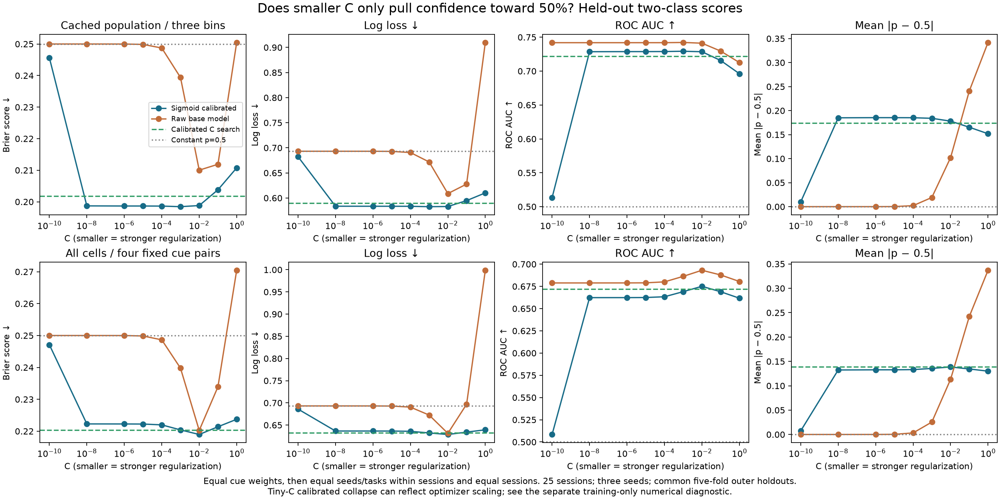

# Regularization, confidence shrinkage, and probability quality

This follow-up tests whether the advantage of fixed C=0.01 in the
[decoder robustness study](decoder-state-robustness.md) comes mainly from
pulling probabilities toward 50%. It extends the same two-class outer holdouts
to smaller C values and separates statistical regularization, direct probability
shrinkage, and numerical calibration behavior. It is exploratory evidence on
the existing cohort, not independent validation of a newly selected optimum.

**Result:** C=0.01's advantage is not explained by a uniform pull toward 50%.
Its primary calibrated probabilities are slightly farther from 50% and
discriminate better than C search. C=0.001 is almost tied with 0.01 there, but
performs worse in the all-cell/fixed-cue sensitivity. Smaller C is not
consistently better. Extremely small C also exposes numerical calibration
failures, which should be separated from statistical underfitting.

## Why 50% is a reference, not the best possible score

Under the equal-cue scoring used here, constant probability 0.5 has Brier score
**0.25** and log loss **ln(2) ≈ 0.69315**. Moving predictions toward 0.5 can improve
both losses when their original confidence is excessive. That is a useful
correction of overconfidence, not a defect of proper probability scoring. An
informative predictor can outperform the constant reference; shrinking every
prediction completely to 0.5 discards that advantage. Proper scores assess both
probability reliability and useful discrimination, not confidence magnitude
alone; see [Gneiting and Raftery (2007)](https://doi.org/10.1198/016214506000001437).

For binary labels, an exact algebraic identity helps interpret the result:

\[
\operatorname{Brier}
= 0.25 + \mathbb E[(p-0.5)^2]
- 2\mathbb E[(p-0.5)(y-0.5)].
\]

The second term is squared probability spread; the last term measures alignment
with the true label. Pulling probabilities toward 0.5 reduces both. Under the
fixed transform `p_alpha = 0.5 + alpha * (p − 0.5)`, they scale as `alpha²` and
`alpha`, respectively. These are algebraic components, not the usual binned
calibration/resolution decomposition. Positive fixed alpha preserves ranking
and the 0.5 decision boundary except for numerical ties, so it provides a direct
test of probability amplitude without retraining the decoder.

## Matched comparison

Use all **25 sessions**, the same **three seeds**, and common **five-fold outer
trial holdouts** as the earlier study. The primary panel uses cached stationary
cells and three 50 ms delay windows (500, 950, and 1350 ms). The sensitivity uses
all exported cells and four fixed opposite-cue pairs at 950 ms. Cue classes have
equal scoring weight; seeds and bins/pairs are averaged within sessions, then
sessions receive equal weight. Per-monkey summaries use the confirmed A/H/J
mapping.

The fixed C curve is **1, 0.1, 0.01, 0.001, 10⁻⁴, 10⁻⁵, 10⁻⁶, 10⁻⁸, 10⁻¹⁰**.
All fits use balanced class weights. For every C, compare the production sigmoid
calibration with its final uncalibrated base model, trained on exactly the same
outer-training rows. Outer test trials enter neither scaling nor calibration.
The last C is an explicit numerical stress test.

The previously computed calibrated C-search predictions serve as the reference.
Their archive, task identities, labels, seeds, and source hashes are checked.
Recomputed calibrated C=1 and C=0.01 predictions must match the old archive
exactly. Direct shrinkage controls use fixed alpha values **0, 0.1, 0.25, 0.5,
0.75, and 1**, with no alpha estimated from outer test labels.

No state durations or M1 results enter the comparison. Selecting a C or alpha
after viewing these curves is exploratory; its reported outer score is not an
unbiased estimate of a procedure that selected it. Session-bootstrap intervals
are nominal and do not account for the dependence of recordings within only
three monkeys.

## Results of the C sweep

All 175 tasks completed in **132.9 seconds with eight workers**, including data
preparation and evidence generation. Calibrated C=1 and C=0.01 predictions match
the earlier archives exactly across every task and seed. No fitting warnings
occurred; this alone does not exclude numerical stopping issues.

These rows use sigmoid calibration. Scores are equal-session means; probability
distance is mean absolute distance from 0.5 in percentage points.

| C procedure | Primary Brier | Primary log loss | Primary AUC | Primary distance from 50% | All-cell/fixed-cue Brier |
| --- | ---: | ---: | ---: | ---: | ---: |
| C search | 0.20175 | 0.58996 | 0.72186 | 17.44 pp | 0.22041 |
| 1 | 0.21074 | 0.61019 | 0.69621 | 15.19 pp | 0.22374 |
| 0.1 | 0.20380 | 0.59477 | 0.71565 | 16.54 pp | 0.22139 |
| **0.01** | **0.19880** | **0.58306** | **0.72857** | **17.81 pp** | **0.21897** |
| 0.001 | 0.19845 | 0.58272 | 0.72928 | 18.40 pp | 0.22041 |
| 0.0001 | 0.19863 | 0.58343 | 0.72886 | 18.52 pp | 0.22199 |
| 10⁻⁵ | 0.19865 | 0.58353 | 0.72876 | 18.53 pp | 0.22224 |
| 10⁻⁶ | 0.19866 | 0.58354 | 0.72874 | 18.53 pp | 0.22227 |
| 10⁻⁸, some numerical degeneration | 0.19870 | 0.58362 | 0.72857 | 18.50 pp | 0.22229 |
| 10⁻¹⁰, numerical stress | 0.24563 | 0.68235 | 0.51330 | 1.00 pp | 0.24710 |
| Constant p=0.5 | 0.25000 | 0.69315 | 0.50000 | 0.00 pp | 0.25000 |

C=0.001 minus C=0.01 changes primary Brier by **−0.000355**, with nominal
session-bootstrap interval **[−0.001087, 0.000393]**; 13/25 sessions favor 0.001.
The log-loss change is −0.000343 [−0.002134, 0.001418]. Monkey A worsens while
H and J improve slightly. This is not a stable advantage.

In the all-cell/fixed-cue panel, C=0.001 worsens Brier by **0.001438
[0.000258, 0.002625]** and log loss by **0.003447 [0.000713, 0.006236]**.
All three monkeys worsen on both probability losses; only 8/25 sessions favor
0.001 on Brier. Performance worsens further below 0.001 before leveling off.
These intervals are descriptive, not multiplicity-adjusted or animal-cluster
confidence intervals.

Without calibration, shrinkage occurs, but going too far **worsens** scores
toward the constant reference. Primary raw C=0.01 has Brier/log loss
**0.21002/0.60879**; C=0.001 gives **0.23939/0.67183**; C=10⁻⁴ gives
**0.24873/0.69061**. Probability distance falls from 10.21 to 1.91 to 0.214
percentage points. Ranking can remain useful even near 0.5: raw C=10⁻⁶ has AUC
0.74189 but Brier 0.24999. Good discrimination alone is not good probability
scaling.



### Direct shrinkage does not explain the fixed-C advantage

Halving searched calibrated predictions' distance from 0.5 changes primary
Brier **0.20175 → 0.21287** and log loss **0.58996 → 0.61582**, while AUC and
balanced accuracy stay unchanged. Alpha=0.75 also worsens both primary losses.
In the sensitivity, alpha=0.75 slightly improves log loss (0.63219 → 0.63161)
but worsens Brier (0.22041 → 0.22110). Modest confidence correction can help one
loss without explaining the fixed-C result.

An algebraic check even allows one common alpha to be chosen **retrospectively
using all evaluation labels**. From the saved spread `S` and alignment `L`,
minimum Brier on these same data occurs at `alpha = clip(L/(2*S), 0, 1)`.
The optimistic floors are **0.20168 / 0.22014** in the two panels, both worse
than fixed C=0.01 (**0.19880 / 0.21897**). This is not unbiased performance of
tuned shrinkage. It shows only that one global uniform factor cannot reproduce
the observed fixed-C advantage; it does not exclude session-dependent
recalibration.

Fixed C=0.01 also improves primary AUC **0.72186 → 0.72857** and balanced
accuracy **68.00% → 68.50%**. Both improve slightly in the sensitivity. Positive
uniform shrinkage cannot make those changes. Primary probability spread
increases; sensitivity mean distance decreases only slightly
(13.882 → 13.856 percentage points).

**Decision:** C=0.01 remains the more consistent fixed-C candidate across these
panels. C=0.001 has no robust advantage. This does not establish a universal
optimum or validate the production search scoring rule. Evaluate any revised
selection rule on fresh holdouts before changing defaults or recomputing
matched state/null estimates.

## Why very small C need not give calibrated probabilities of 50%

The base logistic model shrinks its coefficients as C decreases. Its raw margins
and raw probabilities consequently approach zero and 0.5, respectively. But
the fitted sigmoid has a free slope: it can expand very small margins again.
Consequently, very small C can change the direction of the feature weights
without forcing the final calibrated predictions to become uninformative.
This follows from the regularized
[LIBLINEAR objective](https://github.com/cjlin1/liblinear/blob/master/README)
and the [sigmoid calibration model](https://scikit-learn.org/1.8/modules/calibration.html).

A separate numerical check uses session **221021**, the largest cached decoder
population, at 950 ms and the first predefined outer fold. It reconstructs the
training-only calibration margins independently, verifies the production fit,
then centers/scales those margins using their **training OOF** weighted mean and
SD. Applying the same transform to final-base test margins leaves the theoretical
sigmoid family and weighted Platt objective unchanged.

In this one fold, reducing C from 10⁻⁶ to 10⁻⁸ reduces training OOF margin SD
from approximately **1.10×10⁻⁴ to 1.10×10⁻⁶**, while the magnitude of the fitted
sigmoid slope rises from roughly **7,552 to 755,142**. Calibrated test probability
SD remains about **0.175**. Normalized and production calibrated predictions
agree within 7×10⁻⁹ through C=10⁻⁸.

At C=10⁻¹⁰ and 10⁻¹², the installed sklearn 1.8 optimizer instead stops after
**zero iterations**, with slope zero and all predictions 0.5. The slope gradient
is already below its absolute stopping tolerance. Training-only normalization
lowers the same weighted Platt objective by **9.26** and restores nonconstant
probabilities. This identifies a numerical stopping issue rather than a necessary
statistical limit of calibration. The
[versioned implementation](https://github.com/scikit-learn/scikit-learn/blob/1.8.0/sklearn/calibration.py)
rescales large margins downward but does not normalize tiny margins upward.

Correctly solving that training objective does not guarantee better held-out
performance: in this single fold, normalized tiny-C calibration has Brier
**0.25373**, worse than the constant reference. This numerical diagnostic is
therefore not evidence that normalized calibration is a better decoder.

The full sweep already contains some degenerate calibration at C=10⁻⁸:
**26/1,125** primary fits and **61/1,500** sensitivity fits have exactly zero
sigmoid slope, versus none at C=10⁻⁶. At C=10⁻¹⁰, those counts reach
**1,097/1,125** and **1,466/1,500**. Those aggregate endpoints mix informative
and constant calibration fits; they should not be interpreted as a clean
statistical regularization limit. A zero slope implies a constant probability
within that fitted fold, not necessarily an exactly representable 0.5 in every
fold. The plotted raw probabilities retain nonzero differences and can retain
ranking even when their displayed confidence rounds to 50%.

## Evidence and reproduction

Use the existing environment from the repository root:

```bash
OPENBLAS_NUM_THREADS=1 OMP_NUM_THREADS=1 .venv/bin/python scripts/next/validate_regularization_path.py --workers 8 --max-wall-seconds 3300
OPENBLAS_NUM_THREADS=1 OMP_NUM_THREADS=1 .venv/bin/python scripts/next/validate_calibration_scale.py
```

Raw held-out probabilities, per-task scores, and calibration diagnostics stay in
ignored experiment directories. The versioned evidence records source hashes,
software versions, equal-session and per-animal results, and the experiment
design. Production defaults and caches are unchanged.

- [Regularization-path evidence](../validation/regularization-path-validation.json).
- [Training-only calibration-scale diagnostic](../validation/calibration-scale-validation.json).
