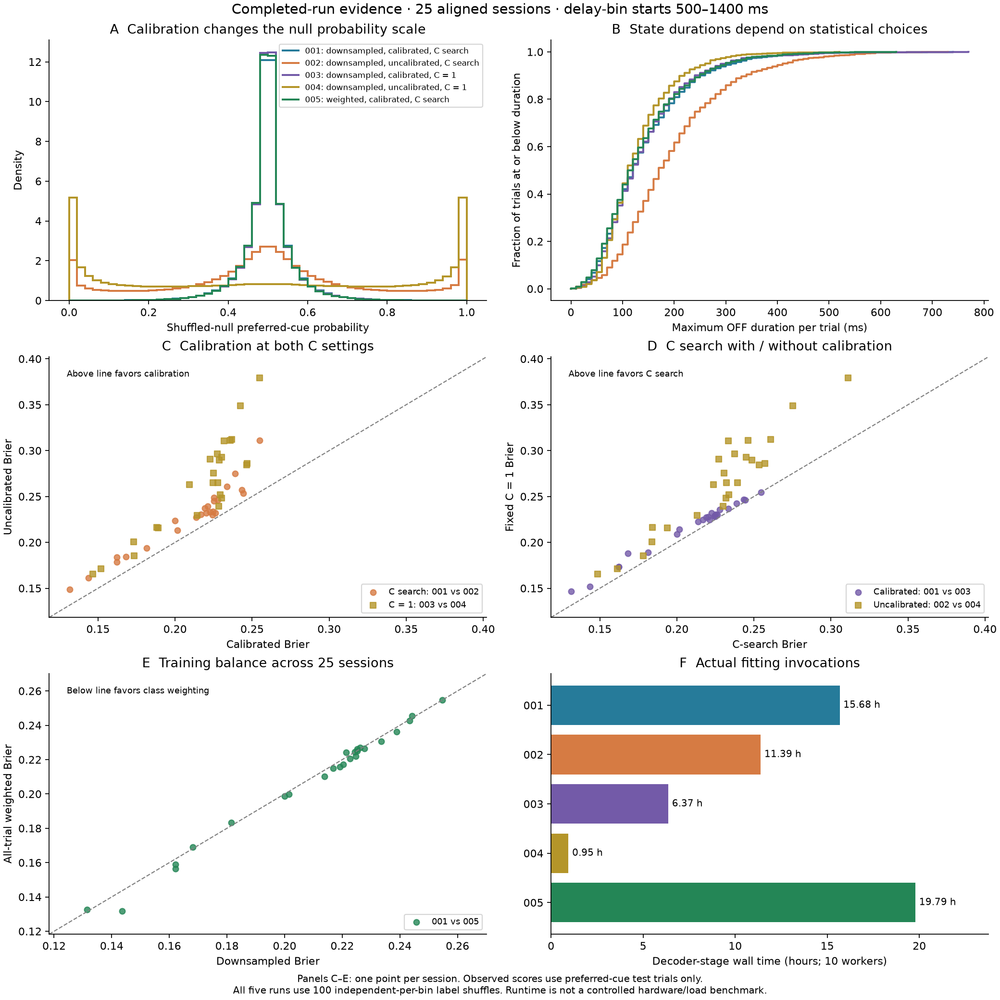

# Statistical choices for reliable decoder state estimates

This document records three decisions that materially affect confidence and
ON/OFF-state estimates: how training classes are balanced, whether probabilities
are calibrated, and how regularization is selected. It separates the intended
analysis policy from evidence already available. **Shorter OFF states are not,
by themselves, evidence of a better estimator.**

The evidence snapshot is dated **2026-09-28**. It covers the completed runs
`next_run_001`, `next_run_002`, and `next_run_003`, plus the focal experiments
described below. Subsequent production runs are outside this snapshot. No
analysis configuration or production cache was modified to prepare it.

**Implementation update:** `configs/next/default_pipeline.json` now implements
the all-trial weighting policy and is the dashboard's default template. Choose
`decode.training_balance` to use balanced class weights, historical balanced
trial subsampling, or no balancing. Weighting applies within every classifier
fit and to pooled probability calibration, including null fits. The dated
evidence below is unchanged; this implementation does not add a full-session
validation of weighted production results. See
[training-class balance](configuration.md#training-class-balance) for exact
settings, SVM handling, and migration.

| Decision | Intended policy | Current evidence |
| --- | --- | --- |
| Training-class balance | Use all eligible training trials with balanced class weights; balance calibration for the same cue prior | Improved prediction quality and seed stability in the session-221024 experiment; confirm across sessions |
| Confidence calibration | Retain training-only sigmoid calibration for observed and null fits | `next_run_001` vs `next_run_002`: better preferred-cue probability scores and a much less extreme null distribution |
| Regularization | Retain training-only C search as the current reference; evaluate cheaper alternatives separately | `next_run_001` vs `next_run_003`: modest, consistent probability-score gains, at substantial additional runtime |

The completed-run comparisons align **25 sessions, 1,590 preferred-cue test
trials, and 161 time bins per trial**. The delay analysis uses the 91 bin starts
from 500 through 1400 ms, inclusive: 144,690 observed trial-bin predictions and
14,469,000 null predictions per run. Each window covers 50 ms and advances by
10 ms. Durations count bin starts ×10 ms, so the full delay grid represents
910 ms under the implemented convention.

Session cues, neuron IDs, test-trial IDs/order, and time grids match across all
three runs. Cached scientific decoder settings differ only as shown below.
All three use random downsampling, seed 42, stationary cells, and 100
independently permuted training-label null fits per trial/bin.

| Run | Sigmoid calibration | C selection |
| --- | --- | --- |
| `next_run_001` | Enabled, five folds | Search over 1, 0.1, 0.01 |
| `next_run_002` | Disabled | Search over 1, 0.1, 0.01 |
| `next_run_003` | Enabled, five folds | Fixed C=1 |

Reported run-comparison scores weight each delay trial-bin equally. They are
**preferred-cue-only scores**, not balanced two-class accuracy or a complete
calibration assessment: every cached test label is 1. Overlapping bins, shared
training sets, and repeated null fits are dependent; their large counts must
not be treated as independent statistical replicates. Cell screening remains
fixed at the full-session level. See the [analysis methods](methods.md) for
the underlying estimator and state definitions.

## 1. Training-class balance: retain trials instead of randomly discarding them

### The failure mode observed with downsampling

The historical procedure first excludes the test trial, then randomly samples
the larger cue class down to the smaller class's size. Each observed fit and
its shuffled-label null fits use the same selected training trials. This
equalizes class counts, but turns the identity of discarded trials into a
source of estimator variability.

In session **221024**, target trial **136** is cue 1. Its available training
pool contains 57 correct cue-1 trials and 86 correct opposite-cue trials.
Downsampling keeps 57+57=114 trials and discards 29 opposite-cue trials. The
decoder has 208 neuronal features. The legacy and next pipelines generate
different balancing sequences even when both receive seed 42, so equal seeds
do not imply equal training membership. Trial IDs here are zero-based indices
in the original recording, not rows in a decoder cache.

The discrepancy first appeared as a maximum OFF duration of **140 ms in
`run_037_full_session` versus 240 ms in `next_run_001`**. A decisive connecting
bin starts at 830 ms and uses activity in [830, 880) ms. A small confidence
change there can split one long contiguous OFF interval into two shorter ones.
The held-out trial's activity need not change at all.

A controlled substitution established that membership matters. Starting with
the original next training set, replace opposite-cue trial 233 with trial 199
in the same row position, retaining the other 113 trials and the 57/57 counts.
Rerun C selection, sigmoid calibration, and 100 null fits at all 161 bins:

| Quantity | Original next training set | Replace 233 with 199 |
| --- | ---: | ---: |
| Target confidence at 830 ms | 0.5158 | 0.5964 |
| Own-null OFF probability cutoff at 830 ms | 0.5774 | 0.5737 |
| Selected C at 830 ms | 0.01 | 0.01 |
| Maximum OFF duration | 240 ms | 130 ms |

The changed observed predictions still produce 130 ms when evaluated against
the original null; changing only the null leaves 240 ms. This substitution is
sufficient to break the long interval, but does not explain every old/next
difference elsewhere in the trace.

Activity inspection explains the influence. Trials 233 and 199 have similar
total counts in that window—61 versus 58 spikes across the 208 neurons—but
different population patterns. After common per-neuron standardization using
the non-target training pool, trial 233 ranks 7th most similar to the target
among 86 opposite-cue trials; trial 199 ranks 80th. Several influential neurons
fire in both trial 233 and the target, but are silent in 199. Replacing the ten
neuronal values with the largest positive individual substitution effects
reproduces approximately 88% of the full probability change. These partial
patterns are synthetic diagnostic probes, not biological trials.

Later seed experiments identified another influential pair: trials 181 and 5.
Seeds 1012 and 1018 included 181 and excluded 5 at the critical bin. A balanced
181→5 substitution raised confidence from 0.472→0.682 and 0.361→0.586 with C
and remaining calibration-fold assignments fixed. Trial 5 was already present
in both original seed-42 runs, so this pair explains later seed sensitivity,
not the original membership difference. Effects depend on the remaining
training data; no trial is a universal switch or an established bad recording.

### Implemented fix and how it is fitted

Retain every eligible non-target training trial and assign each trial in class
`k` weight `n / (2 * n_k)`. Both cue classes then have equal total weight. In
the focal 57/86 pool, individual weights are approximately 1.2544 and 0.8314,
respectively, with total weight 71.5 per class. This is the convention used by
[`LogisticRegression(class_weight="balanced")`](https://scikit-learn.org/1.8/modules/generated/sklearn.linear_model.LogisticRegression.html).

The intended procedure is:

1. Exclude the complete test trial before training, scaling, C selection, or
   calibration. Keep all remaining eligible trials.
2. Recompute balanced class weights within every inner training fold. Fit its
   scaler using only that fold's training activity. The focal experiment kept
   the usual unweighted `StandardScaler`.
3. Retune C rather than assuming that the optimum survives the change in
   sample count and weighted loss. In the experiment the grid and balanced-
   accuracy scoring rule remained unchanged.
4. Calibrate out-of-fold margins with equal total weight per cue as well.
   Otherwise ordinary calibration on the 57/86 pool targets its unequal cue
   prevalence even though the classifier uses balanced weights.
5. Use the same full training membership for observed and null fits. For every
   null, permute training labels and repeat weighting, C selection, and
   calibration under those labels. Never reuse a downsampled null as the
   production null for the weighted estimator.

The target is an **equal-cue-prior decoding probability**, consistent with the
previous balanced sampling design. It is not an estimate of the recording's
natural cue prevalence. The change retains difficult as well as easy examples;
it does not select trials based on their effect on the test confidence.

### Evidence from the all-trial weighting experiment

The focal comparison used five fitting seeds, 42–46, and 100 fresh null fits
per bin and seed. Both methods used common source-trial-based CV conventions.
A separate evaluation used three repeats of five outer folds on the 143
non-target trials, with C selection and calibration fitted entirely inside
each outer training fold. The target trial did not enter this evaluation.
Scores average individual fits, not a five-model ensemble.

| Outer-validation metric | Downsampling | All trials + balanced weights |
| --- | ---: | ---: |
| Class-balanced Brier score, lower is better | 0.1370 | 0.1269 |
| Class-balanced log loss, lower is better | 0.4267 | 0.3994 |
| Balanced accuracy | 80.59% | 82.08% |
| Mean prediction SD across fitting seeds | 0.0665 | 0.0243 |

Brier loss fell 7.4%, and prediction variability fell 63.5%. Brier improved
in all three outer-fold repetitions and on 132 of 143 trial-averaged
comparisons. These are exploratory, correlated comparisons within one session,
not 143 independent confirmations of a new default.

| Seed | Downsampled maximum OFF | Weighted maximum OFF |
| --- | ---: | ---: |
| 42 | 240 ms | 130 ms |
| 43 | 200 ms | 120 ms |
| 44 | 200 ms | 120 ms |
| 45 | 130 ms | 130 ms |
| 46 | 120 ms | 120 ms |

Every weighted fit classified 830 ms as not OFF. These runs regenerate only
the focal trial's nulls; using either historical session background, a
focal-only background, or skipping cluster correction did not change these
maxima. They are not a complete weighted session-level cluster analysis.

**Decision:** use all-trial balanced weighting as the intended replacement for
random balancing, and evaluate completed production results across sessions.
Weighting removes arbitrary exclusion; it does not remove finite-sample
influence. For example, removing trial 5 from the weighted seed-42 fit still
lowers 830 ms confidence from 0.5854 to 0.5280 in an observed-only diagnostic.
Nor does this change establish the biological correctness of a 120–130 ms
OFF duration. This focal experiment does not validate later full-session
production results, which require their own evaluation.

## 2. Confidence calibration: the probability scale affects state inference

### Why classification accuracy is insufficient

The decoder produces probabilities, and the state stage compares each observed
probability with the mean and SD of probabilities from shuffled-label fits:
`z = (p_observed - mean(p_null)) / sd(p_null)`. The current candidate thresholds
are `z <= 0.842` for OFF and `z >= 1.645` for ON, followed by cluster rules.
Consequently, the probability scale and the behavior of the null fits matter
even when predicted cue labels barely change.

Sigmoid calibration learns a mapping from classifier margins to probabilities
using out-of-fold training predictions. In this implementation,
`CalibratedClassifierCV(method="sigmoid", ensemble=False)` uses five grouped
folds and a final base classifier fitted on the full selected training set.
Calibration is repeated for every observed and null training problem. The
held-out target is excluded. Merely applying a logistic sigmoid to a margin
does not guarantee reliable probabilities in finite, regularized fits;
cross-fitted calibration estimates a separate mapping.

Probability scores and reliability are related but distinct. Brier score and
log loss assess overall probabilistic prediction quality, including
discrimination; a lower Brier score alone does not prove better calibration.
A full reliability assessment needs representative held-out labels from both
classes. See [scikit-learn's calibration guide](https://scikit-learn.org/1.8/modules/calibration.html).

### Evidence: `next_run_001` versus `next_run_002`

The cached selected C values are **identical for every observed and null fit**
across these runs, including all 161 bins. The comparison therefore does not
confound calibration with a changed C-search result.

| Delay-period metric | `001`: sigmoid calibrated | `002`: calibration disabled |
| --- | ---: | ---: |
| Preferred-cue-only Brier score | 0.20918 | 0.22655 |
| Preferred-cue-only log loss | 0.59968 | 0.69287 |
| Preferred-cue accuracy at p ≥0.5 | 64.19% | 64.08% |
| Mean of per-trial/bin null probability SDs | 0.05992 | 0.24185 |
| Null probabilities below 0.1 or above 0.9 | 0.055% | 17.845% |
| Delay bins classified ON after correction | 34.18% | 1.14% |
| Delay bins classified OFF after correction | 46.93% | 53.31% |
| Mean maximum OFF duration per trial | 140.6 ms | 195.0 ms |
| Median maximum OFF duration per trial | 120 ms | 170 ms |
| Trials with maximum OFF ≥240 ms | 12.77% | 27.74% |

Calibration improves the available Brier score by 7.7% and log loss by 13.4%,
with lower session-average Brier in **all 25 sessions**. Preferred-cue accuracy
changes by only 0.12 percentage points. Thus the evidence concerns probability
quality and state inference, not a large change in basic cue classification.

Both null means remain close to 0.5 when averaged over the delay samples.
However, disabling calibration increases the mean per-bin null SD about
fourfold and frequently assigns near-certain probabilities to models trained
on randomized labels. This is consistent with overconfident outputs under
the shuffled-label training condition. It does not establish a complete
two-class reliability curve for the observed models.

The widened null has a direct consequence for the implemented thresholds:
the ON probability cutoff `mean(p_null) + 1.645 * sd(p_null)` exceeds 1 in
**16.17%** of uncalibrated delay trial-bins, versus none in the calibrated run.
No valid probability can cross that cutoff. This helps explain the loss of
detected ON bins despite nearly unchanged preferred-cue accuracy.

The OFF mask differs in 20.33% of delay trial-bins; maximum OFF duration changes
for 1,481 of 1,590 trials. Disabling calibration lengthens the maximum for
1,236 trials and shortens it for 245. For session 221024, trial 136, the maximum
is **240 ms calibrated versus 280 ms uncalibrated**. At 830 ms, p changes only
from 0.5158 to 0.5071, while the own-null OFF probability cutoff changes from
0.5774 to 0.6768. This example illustrates why observed confidence must be
interpreted with its own fitted null distribution.

A matched null is necessary, but it does not make state inference invariant
to calibration. A single common positive affine transformation would cancel
in the z score. These runs instead apply fitted nonlinear mappings separately
to observed and shuffled models; their distribution shapes and relative scales
can change.

**Decision:** retain training-only sigmoid calibration, including in the
weighted procedure and in every null fit. These comparisons support that
choice for this dataset. They do not imply that all logistic regression models
always require calibration or that the calibrated state labels are ground
truth. Confirm reliability with two-class held-out predictions and keep the
calibration cue prior consistent with the weighting policy.

## 3. C selection: a modest prediction gain with a substantial runtime cost

### What the grid search changes

The logistic classifier uses L2 regularization. `C` is the inverse
regularization-strength parameter: smaller values shrink coefficients more
strongly. The current search evaluates **C=(1, 0.1, 0.01)** using mean balanced
accuracy over five source-trial-grouped inner folds, with scaling fitted only
inside each training fold. A tie selects the first candidate in that order.
See the [estimator definition](https://scikit-learn.org/1.8/modules/generated/sklearn.linear_model.LogisticRegression.html).

Search is performed separately for every observed and null trial/bin problem.
The chosen C is then used for sigmoid calibration and final fitting. The
search objective is classification accuracy, not probability loss, and the
winning inner-CV score is not an unbiased estimate of generalization quality.
Selecting among noisy CV estimates can itself overfit the selection criterion;
see [Cawley and Talbot (2010)](https://www.jmlr.org/papers/v11/cawley10a.html).

### Evidence: `next_run_001` versus `next_run_003`

Both runs use sigmoid calibration and the same balancing seed, populations,
time grid, and null policy. `001` searches C; `003` fixes C=1. Where the search
selects C=1, the observed probabilities in the two caches are **exactly equal**
at every matching bin. This is a useful internal control for the comparison.

| Delay-period metric | `001`: search C | `003`: fixed C=1 |
| --- | ---: | ---: |
| Preferred-cue-only Brier score | 0.20918 | 0.21634 |
| Preferred-cue-only log loss | 0.59968 | 0.61859 |
| Preferred-cue accuracy at p ≥0.5 | 64.19% | 62.82% |
| Mean per-trial/bin null probability SD | 0.05992 | 0.05755 |
| Delay bins classified ON after correction | 34.18% | 28.62% |
| Delay bins classified OFF after correction | 46.93% | 50.11% |
| Mean total OFF duration per trial | 427.0 ms | 456.0 ms |
| Mean maximum OFF duration per trial | 140.6 ms | 139.5 ms |
| Median maximum OFF duration per trial | 120 ms | 120 ms |

Search improves the available Brier score by **3.3%**, log loss by **3.1%**,
and preferred-cue accuracy by **1.37 percentage points**. Its session-average
Brier is lower in all 25 sessions, although the advantage is very small in
one session. These are descriptive paired results for the preferred-cue test
population; they do not establish two-class performance or statistical
independence across bins.

The search frequently chooses stronger regularization:

| Selected C | Observed delay fits | Null delay fits |
| --- | ---: | ---: |
| 1 | 18.22% | 37.24% |
| 0.1 | 25.09% | 24.42% |
| 0.01 | 56.69% | 38.34% |

Thus C=1 differs from the selected value in 81.78% of observed delay fits.
This frequency supports evaluating stronger regularization, but does not
prove that the winning C in every individual noisy fold comparison is optimal.
Calibration and regularization address different parts of the estimator:
calibration adjusts the margin-to-probability mapping; C changes the fitted
classifier. Calibration does not substitute for choosing an appropriate C.

The nearly identical mean maximum OFF duration hides substantial changes:
10.997% of delay OFF-mask entries differ, and 1,042 of 1,590 trials have a
different maximum. Fixed C=1 lengthens the maximum for 552 trials and shortens
it for 490; the mean absolute per-trial change is 27.2 ms. Total OFF time also
increases even though mean maximum duration barely changes. Total duration
and the longest contiguous interval must therefore be evaluated separately.

For the focal session-221024 trial, both runs give a **240 ms** maximum.
At 830 ms, search selects C=0.01 and p=0.5158, whereas fixed C=1 gives p=0.5416;
both remain below their own OFF cutoffs. At 910 ms, search already selects
C=1, and the observed probabilities are identical. **Fixing C=1 does not
resolve the original long-segment example.**

### Runtime and the practical decision

The original fitting manifests record these decoder-stage wall times, each
configured for ten workers:

| Procedure | Decoder wall time |
| --- | ---: |
| C search + sigmoid calibration (`001`) | 15.68 hours |
| C search without calibration (`002`) | 11.39 hours |
| Fixed C=1 + sigmoid calibration (`003`) | 6.37 hours |

These are observed invocation times, not a controlled hardware/load benchmark.
In particular, `001`'s latest manifest records a 21.8-second **plot-only**
decoder invocation; it must not be used as its fitting runtime. The original
fitting manifest is identified in the evidence snapshot.

**Decision:** keep C search as the current reference because the completed
runs show a consistent probability-score benefit. Treat fixed C=1 as a faster
alternative with a measured accuracy/probability tradeoff, not an equivalent
configuration. The comparison has not tested fixed C=0.1 or C=0.01, so it does
not establish that the full grid is necessary or that C=1 is the best fixed
choice. Reassess that tradeoff after moving to all-trial weighting, whose
sample count and weighted loss differ from these downsampled runs.

A useful future comparison would evaluate fixed C values and probability-based
selection on common outer holdouts containing both cue classes, with all
calibration inside training folds. Every null must repeat the chosen search
procedure. Do not choose C, its scoring rule, or a seed by inspecting the
target's state duration.

### Evidence, reproduction, and remaining limitations



The [evidence snapshot](../validation/statistical-choices-evidence.json) includes
per-session and aggregate metrics, exact alignment checks, focal-bin values,
selected-C counts, fitting-manifest IDs, and SHA-256 hashes of the decoder and
state caches. It also preserves compact summaries and hashes of the earlier
weighting, activity, and trial-swap experiments.

The source script `scripts/next/compare_statistical_choices.py` regenerates
the completed-run evidence and figure using the existing local environment.
It is a reproduction utility for this dated three-run comparison, not a
pipeline stage or a tool that automatically selects the latest run.
Run it from the repository root:

```bash
.venv/bin/python scripts/next/compare_statistical_choices.py
```

It reads `cache/next_run_001`, `cache/next_run_002`, and `cache/next_run_003`
sequentially, with one numerical thread and no model fitting. Optional earlier
experiment summaries are read from
`cache/comparisons/run_037_vs_next_001_221024/`. If those optional local reports
are absent, their existing evidence snapshots are retained with their original
source hashes; they are not presented as newly recomputed experiments.
Only `docs/validation/statistical-choices-evidence.json` and
`docs/assets/statistical-choices-comparison.png` are written. The script checks source-file hashes
before and after each read; it does not contact the dashboard, synchronize
dependencies, stop workers, or regenerate production stages.

For all three decisions, the remaining limitations are shared: fixed
full-session cell selection, independently permuted null labels across time,
preferred-cue-only production evaluation, and no biological ON/OFF ground
truth. The focal weighted experiment additionally lacks a fully regenerated
session-level null pool. The existing
[null-time-structure option](configuration.md#null-shuffle-time-structure)
addresses within-trial permutation consistency separately; calibration, C
search, and balanced weights do not repair that issue automatically.
